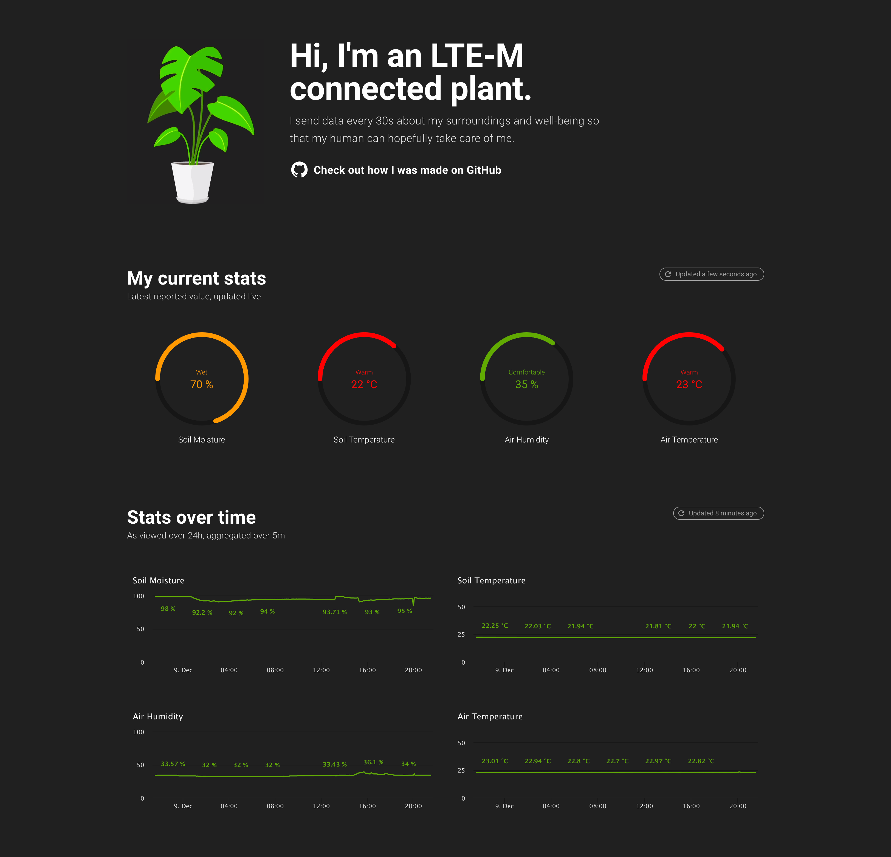

# Connected Plant

LTE-M connected Monstera plant.



## MIC Uplink Transform

```js
var resources = payload.toString('utf8').split(',')
var output

try {
  output = {
    plant: {
      type: 'measurements',
      soil_moisture: parseInt(resources[0]),
      soil_temperature: parseFloat(resources[1]),
      air_temperature: parseFloat(resources[2]),
      air_humidity: parseFloat(resources[3]),
      air_heat_index: parseFloat(resources[4])
    }
  }
} catch (e) {
  output = { uplink_transform_error: e.message }
}

return output
```
